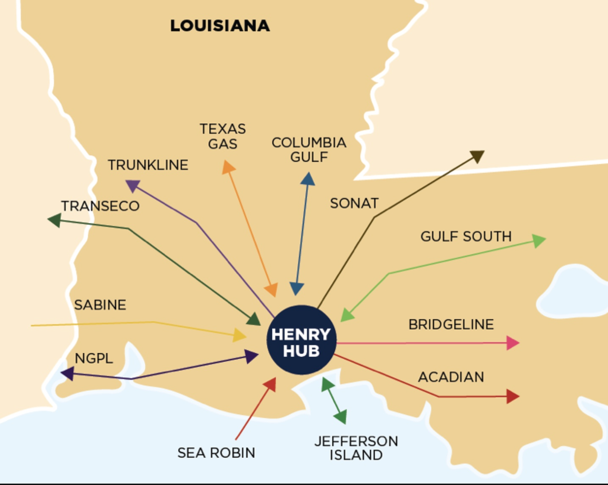

# Introduction 

```{r,echo=FALSE}


```

[Source of Picture](https://www.energypolicy.columbia.edu/research/report/asian-lng-trading-hubs-myth-or-reality) 

The Henry Hub is a natural gas pipeline distribution system in Erath, Louisiana, the United States. The pipeline system is owned and managed by Sabine Pipe Line LLC and its affiliates. The Henry Hub is part of the high integrated transmission grid in the United States. It connects eight interstate and three intrastate pipelines. The Henry Hub also has a direct connection with the storage facilities, which the salt-dome cavern is located. These facilities allow for injection and withdrawal cycles each year [(Wikipedia, 2020).](https://en.wikipedia.org/wiki/Henry_Hub)

The Henry Hub is located in the Southwest region of the US, where the most extensive gas pipeline is located. Thus, it allows gas to be distributed directly from the supply basin to the entire United States or to export to major customers[(cmegroup, 2020).](https://www.eia.gov/dnav/ng/NG_PRI_FUT_S1_M.htm) Because of its strategic location and logistic infrastructure, the Henry Hub becomes the pricing benchmark for natural gas spot and futures price traded on the New York Mercantile Exchange (NYMEX) and also becomes the primary gas pricing point in the North America market [(Wikipedia, 2020).](https://en.wikipedia.org/wiki/Henry_Hub)

Our objective in this study is to build models based on the time-series dataset of the Henry Hub natural gas price and create a two-year forecast by using different time series models in R programming. 

**Disclaimer :** This project is to test the application of a few models applied to the base case as part of the requirement of the courses. Thus, the result should not be considered as an indicator of the real value of the future natural gas price.

# Dataset Information 

The dataset is collected from [the US Energy Information Administration](https://www.eia.gov/dnav/ng/hist/rngwhhdm.htm). The dataset consists of monthly Henry Hub natural gas spot prices starting from January 1997 until March 2022. The price is denominated by US dollar Metric Million British thermal unit (US$/MMBtu). Prices are based on delivery at the Henry Hub in Louisiana. Official daily closing prices at 2:30 p.m. from the trading floor of the New York Mercantile Exchange (NYMEX) for a specific delivery month [(EIA, 2020).](https://www.eia.gov/dnav/ng/NG_PRI_FUT_S1_M.htm)

# Data Preparation 

Time series data is a collection of measurements obtained from the same source over a time interval. In the time series, four requirements need to be confirmed before we use the dataset. 

1. The data is numeric.  
2. Data need to be in order based on its time. 
3. No missing value in the dataset.
4. No missing sequence date in dataframe.

In the preparation section, we will manage the dataset to meet all of the above requirements.

## Load Libraries

Attach all libraries used in this project. 

```{r, warning=FALSE, message=FALSE}

library(dplyr) 
library(lubridate) 
library(forecast) 
library(TTR) 
library(MLmetrics) 
library(tseries) 
library(fpp) 
library(TSstudio) 
library(ggplot2)
library(tidyr)
library(padr)
library(hrbrthemes)

```

## Read Dataset

We read our dataset by using function `read.csv()` and assign it as an object called `gas`

```{r}
gas <- read.csv("natural-gas-prices-historical-chart.csv", sep=";")
```

## Observe Dataframe

We observe a dataframe `gas` by using function `str()`. 

```{r}
str(gas)
```
There are 303 observations and 2 variables. The variables are included: 

- date: The monthly date start from January 1997 to March 2022. The data type is character. 
- value: The monthly Henry Hub gas price ($/MMBtu). The data type is numeric, thus it's valid for requirement no.1 (The data type is numeric)

## Change datatype 

In this section, we will change the data type of column date into `date`, rename column `value` into `gas.price`. And we will arrange the dataframe based on column `date` to meet criteria no.2 (Data need to be in order based on its time)

```{r}
gas <- gas %>% 
  mutate(date=ymd(date)) %>% 
  rename(gas.price = value) %>% 
  arrange(date)
```

## Missing Value

We can check the missing value, by using `colSums()` and `is.na()`. In this case, we meet requirement no. 3 which is no missing value found in the dataset. 

```{r}
missing.value <- as.data.frame(colSums(is.na(gas)))
```

```{r, echo=FALSE}
rmarkdown::paged_table(missing.value)
```

Now, we can check if there is any datetime that is not available in this dataset. We can use function `seq.Date()`. Then, we assign it as `period`. 

```{r}
period <- seq.Date(from=as.Date("1997-01-01"), to=as.Date("2022-03-01"), by="month")
```

```{r}
all(period==gas$date)
```
We found that there is no missing sequence date in the dataset. It is implied that our dataframe meets the 4th requirement. Since all requirements are valid, we can use our dataframe. 

# Time Series (Single Seasonal)

## Implement Time Series

In R, the time series dataset is created by using function `ts()`. Our variable of interest is the Henry Hub gas price, so we'll use that as the `data` parameter. Our `start` parameter is January 1997. Since our dataset is monthly and we want to forecast for the yearly price, we set the parameter `frequency` at 12. 

```{r}
gas_ts <- stats::ts(data=gas$gas.price, start=c(1997,1), frequency = 12)
```

## Visualize Time Series

We can visualize the `gas_ts` by using function `autoplot()`

```{r, warning=FALSE}
gas_ts %>% autoplot() +
  theme_ipsum()+
  labs(y="Price ($/MMBtu)", 
       title= "Henry Hub Price from January 1997 to March 2022", 
       caption = "Source : US Energy Information Admistration")+
  geom_vline(xintercept=1999, linetype="dashed", color = "red")+
  geom_vline(xintercept=2008, linetype="dashed", color = "red")
```

> Insight : The plot shows historical gas prices separated by three periods. Between 1997 and 1999, gas prices showed a downward trend. The revolution in US shale gas production has resulted in the growth of gas supply exceeding demand growth. As a result, gas prices have fallen, gas imports and conventional supplies have been stopped. The spike and upward trend in gas prices between 2000 and 2008 were due to the tight supply-demand balance of natural gas, with the highest price at $20.98/MMBtu was occurred in 2006. The economic recession at the end of 2008 has led to a downward trend in gas prices [(API ,2014).](https://www.api.org/~/media/Files/Oil-and-Natural-Gas/Natural-Gas/API-Understanding-Natural-Gas-Markets.pdf). Then, gas production continues to increase in faster rate compared to demand growth, resulting in constant low prices up to March 2022. The lowest gas price occurred in January 2020 as a result of the COVID-19 outbreak.

The below plot is the monthly seasonal gas price pattern. 

```{r}
gas %>% 
  mutate(seasonal = decompose(gas_ts)$seasonal,
         month= month(date)) %>% 
  distinct(month, seasonal) %>% 
  ggplot(mapping = aes(x = month, y = seasonal)) +
  geom_col(fill="#B0A8B9") +
  theme_ipsum(grid="Y") +
  scale_x_continuous(breaks = seq(0,24,1)) +
  labs(title = "Seasonal Analysis",
       subtitle = "Monthly")
```

> Insight : The seasonality of gas price in the US is influenced by two main seasons, which are winter and summer season. The winter season ranges between November and March. During this season, gas consumption generally increases due to heating demand from residential and industrial sector. Thus, the gas future trade at a high price, as shown in the plot. In other hand, the summer season between April to October is indicated by declining gas demand and excess of storage. This lead to a low traded gas price. 


In the next plot, we want to observe a trend and seasonal in the time series dataset based on an autocorrelation plot. The ACF (Correlation) plot is a graph to display a series of correlations in data that changes over time. First, we need to create an object called `gas_observe` by using the function `window()`. Then, we can visualize the ACF by using the function `ggAcf()`. 

```{r} 
# Create an object called `gas_observe` by using function `window()` 
gas_observe <- window(gas_ts)

# Visualize the ACF plot
ggAcf(gas_observe, lag.max = 60) + 
  theme_ipsum(grid="") + 
  labs(title = "ACF Plot For Time Series Dataset `gas_ts`")
```

Based on [Hyndman & Athanasopoulos (2018)](https://otexts.com/fpp2/autocorrelation.html), the trend in the dataset can be indicated by the large and positive autocorrelation in small lags. The trend in the ACF plot is indicated by positive values that will reduce at a slow pace as the lags increase. While the seasonal can be indicated by the larger autocorrelation for the seasonal lags at multiples seasonal frequency than other lags. In the above plot, the trend is indicated by the reduction of autocorrelation as the lags increase, while the seasonality is indicated by the lace pattern. 

## Decompose

Decomposing the time series data means separating the dataset into different components, such as a trend, a seasonal and an error. The objective of decomposition is to get a detailed overview of the time-series data. In R, decomposition can be done by using `decompose()`. Then, we can visualize it by using `autoplot()`. 

```{r}
# Decompose the `gas_ts`
gas_dc <- decompose(gas_ts)

# Visualize the decompose dataset
gas_dc %>% 
  autoplot() +
  theme_minimal()
```

> Insight : 
>
- There is an unclear pattern in the trend plot, illustrated by several bumps in the pattern. It can be indicated that our trend might have an additional seasonality, which is not absorbed from a higher period. Thus, our dataset might be considered as a `complex/multiple seasonal` time series dataset. Note: In the first section, we will use the `gas_ts` time series dataset. Later, we will use `msts()` function to deal with complex/multiple seasonal datasets. 
- The seasonal plot is generated from the average for each period over all periods and then centre around the mean. It is quite difficult to capture the seasonal in the original data. However, there is a seasonal pattern that is relatively constant between 2010 and 2022. Thus, we can assume that the seasonal pattern is additive. 
- The remainder or error plot is generated by eliminating the trend and seasonal pattern. Some part of the plot indicates a high correlation between residuals, thus, the decomposition might be failed to capture the true seasonal component. 

## Cross-Validation 

Cross-validation is to separate the train and test dataset. We use function `tail()` from dataframe `gas_ts` to obtain the `gas_test`. Since we want to forecast for two years, we set `h = 24`. On the other side, the `gas_train` can be obtained by using function `head()`, with h being equal to the length of dataset subtracted by the length of the data test. 

```{r}
# Data test uses `tail()`
gas_test <- tail(gas_ts, 24) 

# Data train uses `head()`
gas_train <- head(gas_ts, -length(gas_test))
```

# Exponential smoothing (ETS) 

**Exponential smoothing** is a time series forecasting method for univariate data. Predictions in the exponential smoothing method use exponentially decreasing weights for past observations. The method includes three smoothing levels of error, trend and seasonal. 

## Fitting Model 

In R, we can use the function `ets()` and specify our time series dataset `gas_train`. Then, we assign it to an abject called `model_ets`. The parameters are includes : 

- `y` : Object time series
- `model` : By setting model=`ZZZ`, the model will automatically choose the best value of three-component of alpha, beta, and gamma. 
- `lambda` : Box-Cox transformation parameter. If lambda = "auto", then a transformation is automatically using selected lambda. Here, the `lambda=0`, implies that it's a log transformation. Based on [Hyndman & Athanasopoulos (2018)](https://otexts.com/fpp2/autocorrelation.html), we can use log transformation to ensure the forecasts and the prediction intervals stay positive. 

```{r}
model_ets <- ets(gas_train, model = "ZZZ", lambda=0)
```

## Intrepretation of Model 

Now, let's observe the summary of the `model_ets`

```{r}
model_ets
```

The output shows that the best model with the lowest AIC value uses ETS(ANN), which is a simple exponential smoothing with additive errors. The alpha used in the model is 0.7902 or near one. It is implied that the fitting error is weighted more to the newest data. 


## Forecasting 

The forecast can be obtained by using function `forecast()` and setting the `h = 24` to obtain a two-year gas price prediction. We use `biasadj = T` to ensure that our point forecast based on mean rather than median [(Hyndman & Athanasopoulos, 2018)](https://otexts.com/fpp2/transformations.html). Assign the forecast in an object called `forecast_ets`. 

```{r}
forecast_ets <- forecast(object =model_ets, h=24, biasadj = T)
```

```{r, echo=FALSE}
table_forecast_ets <- as.data.frame(forecast_ets)
rmarkdown::paged_table(table_forecast_ets)
```

The column `Point Forecast` shows the two-year forecast value of `model_ets`. The Lo-Hi 80 indicates the range of prediction values based on an 80% confidence level, while Hi-Lo 95% indicates a range of prediction values based on a 95% confidence level. 

## Model Evaluation

Forecast error can be observed by using **MAPE (Mean Average Percentage Error)**. MAPE measures the prediction's accuracy of the forecasting method as a percentage. It can be calculated as the average absolute per cent error for each period subtract with actual value, then,  divided by actual value [(Wikipedia, 2022)](https://en.wikipedia.org/wiki/Mean_absolute_percentage_error). 

```{r, warning=FALSE}
rmarkdown::paged_table(as.data.frame(accuracy(forecast_ets, gas_test)))
```

> Insight: Based on the statistical output, the MAPE for the test data is 32.52%, which is very high. The model is also considered an overfitted model due to the difference between MAPE in train data and the test dataset being more than 10%. 

Now, let's visualize the `model_ets` and forecast `model_ets` versus data test.

```{r}
autoplot(forecast_ets, series = "SARIMA", fcol = "light blue") +
  autolayer(gas_test, series = "Actual", color = "black") + 
  autolayer(gas_train, series = "Actual", color = "black") + 
  autolayer(model_ets$fitted, series="Model", color= "red")+
  theme(legend.position = "bottom")+
  labs(subtitle = "The Henry Hub Gas Price, from January 1997 to March 2022",
       y = "Henry Hub Price US$/MMBtu") +
  theme_ipsum() 

```

> Insight : The title indicates the best choice from model = "ZZZ". It is used ETS(ANN), which is a simple exponential smoothing with additive errors. The model could follow the original train dataset, however it is lagging in the model. Also, the forecast shows different pattern with the test data. 


# ARIMA

**ARIMA** (Auto Regression and Moving Average) is a model for forecasting time series for the stationary dataset. A stationary series has no trend and is seasonal, its variation around its mean has a constant pattern [(Nau, 2020)](https://people.duke.edu/~rnau/411arim.htm). ARIMA is a combination of Auto Regression and Moving Average method. Auto Regression means that we build the linear regression based on the lag from data as a predictor. While Moving Average means that we perform a moving average to the data itself. A model is classified as an `ARIMA(p,d,q)` model, where:

- p is the number of autoregressive terms,
- d is the number of differences needed for stationarity, and
- q is the number of lagged forecast errors in the prediction.

The ARIMA model can be implemented by manually setting the p,d,q parameters or automatically implementing by using `auto.arima()`. In this section, we try both methods.

## Fitting ARIMA (Manual)

To check how many differencing we need to generate our dataset to become stationer, we can use function `nsdiff()`

```{r}
ndiffs(gas_train)
```
The output suggests that we need one time differencing. We use function `diff()` for differencing `gas_train`

```{r}
# Create an object called `gas_ts_stationary` : one time differencing of `gas_ts`
gas_ts_stationary <- diff(gas_train, differences= 1)

# Observe the plot of `gas_ts_stationary`
plot(gas_ts_stationary, type="l", main="Stationary `gas_ts`")
```

Even though the plot suggests that our dataset is stationer, we need to confirm with the statistical test by using `adf.test()`. The expectation is to have the p-value less than alpha (p-value < 0.05), thus we can reject $H_0$. 

- $H_0$ : Data is not stationer
- $H_1$ : Data is stationer

```{r, warning=F}
adf.test(gas_ts_stationary)
```
The output shows that one time differencing could transform the dataset to be stationer. Thus, the `d` value is 1. To obtain p and q values, we generate the ACF and PACF plots by using function `tsdisplay()`. 

```{r}
gas_ts_stationary %>% 
  tsdisplay()
```

We can define the `p` value by observing the first four lags in the PACF plot that cut off the blue dash line. Thus, the possible `p` values are 1 and 2. The `q` value can be obtained by observing the first four lags in the ACF plot which cut off the blue dash line. Thus, the possible `q` values are 1 and 2. 

The following are a few possible ARIMA(p,d,q) models

- ARIMA(1,1,0)
- ARIMA(2,1,0)
- ARIMA(0,1,1)
- ARIMA(1,1,1)
- ARIMA(2,1,1)
- ARIMA(0,1,2)
- ARIMA(1,1,2)
- ARIMA(2,1,2)

The ARIMA model can be generated by using the function `Arima()` and setting the `order` based on (p,d,q) values. We use `lambda=0` (log transformation) to ensure positive value of predictions and forecast. 

```{r}
# Fitting Model ARIMA(1,1,0)
model_arima1 <- Arima(gas_train, order=c(1,1,0), lambda=0)

# Fitting Model ARIMA(2,1,0)
model_arima2 <- Arima(gas_train, order=c(2,1,0), lambda=0)

# Fitting Model ARIMA(0,1,1)
model_arima3 <- Arima(gas_train, order=c(0,1,1), lambda=0)

# Fitting Model ARIMA(1,1,1)
model_arima4<- Arima(gas_train, order=c(1,1,1), lambda =0)

# Fitting Model ARIMA(2,1,1)
model_arima5<- Arima(gas_train, order=c(2,1,1), lambda=0)

# Fitting Model ARIMA(0,1,2)
model_arima6<- Arima(gas_train, order=c(0,1,2), lambda=0)

# Fitting Model ARIMA(1,1,2)
model_arima7<- Arima(gas_train, order=c(1,1,2), lambda=0)

# Fitting Model ARIMA(2,1,2)
model_arima8<- Arima(gas_train, order=c(2,1,2), lambda=0)
```

Now, we can check the AIC of the eight models and search for the lowest value of AIC. 

```{r, echo=F}
rmarkdown::paged_table(data.frame(arima1 = model_arima1$aic, 
                                  arima2 = model_arima2$aic, 
                                  arima3 = model_arima3$aic, 
                                  arima4 = model_arima4$aic, 
                                  arima5 = model_arima5$aic, 
                                  arima6 = model_arima6$aic,
                                  arima7 = model_arima7$aic, 
                                  arima8 = model_arima8$aic))
```

Based on the output, `model_arima2` has the lowest AIC value, thus the best model ARIMA based on manual fitting is ARIMA(2,1,0). 

## Fitting ARIMA (Auto)

The ARIMA model can be automatically generated by using function `auto.arima()`. 

```{r}
model_arima_auto <- auto.arima(gas_train, seasonal = F, lambda =0)
model_arima_auto
```
> Insight : Based on the output, `model_arima_auto` is similar with `model_arima2` and both models are indicated as the model with the lowest AIC value of -182.14. 

## Forecasting

The forecast can be obtained by using function `forecast()` and setting the `h = 24` to obtain a two-year gas price prediction. We use `biasadj = T` to ensure that our point forecast based on means rather than median. 

```{r}
# Forecast for auto ARIMA model
forecast_arima <- forecast(model_arima_auto, h=24, biasadj = T)

# Forecast for manual ARIMA model
forecast_arima1 <- forecast(model_arima1, h=24, biasadj = T)
forecast_arima2 <- forecast(model_arima2, h=24, biasadj = T)
forecast_arima3 <- forecast(model_arima3, h=24, biasadj = T)
forecast_arima4 <- forecast(model_arima4, h=24, biasadj = T)
forecast_arima5 <- forecast(model_arima5, h=24, biasadj = T)
forecast_arima6 <- forecast(model_arima6, h=24, biasadj = T)
forecast_arima7 <- forecast(model_arima7, h=24, biasadj = T)
forecast_arima8 <- forecast(model_arima8, h=24, biasadj = T)
```


## Model Evaluation 


```{r, echo=F}
rmarkdown::paged_table(data.frame(arima_auto = accuracy(forecast_arima, gas_test)[2,5],
                                  arima1 = accuracy(forecast_arima1, gas_test)[2,5], 
                                  arima2 = accuracy(forecast_arima2, gas_test)[2,5],
                                  arima3 = accuracy(forecast_arima3, gas_test)[2,5],
                                  arima4 = accuracy(forecast_arima4, gas_test)[2,5],
                                  arima5 = accuracy(forecast_arima5, gas_test)[2,5],
                                  arima6 = accuracy(forecast_arima6, gas_test)[2,5],
                                  arima7 = accuracy(forecast_arima7, gas_test)[2,5],
                                  arima8 = accuracy(forecast_arima8, gas_test)[2,5]))
                       
                              
```

```{r, echo=FALSE}
autoplot(forecast_arima1 , series = "ARIMA", fcol = "light green") +
  autolayer(gas_test, series = "Actual", color = "black") + 
  autolayer(model_arima1$fitted, series="Model", color= "orange")+
  theme(legend.position = "bottom")+
  labs(subtitle = "The Henry Hub Gas Price, from January 1997 to March 2022",
       y = "Henry Hub Price US$/MMBtu") +
  theme_ipsum() 
  
```

> Insights:
>
- Even though `model_auto_arima` and `model_arima2` have the lowest AIC values, this does not mean that these models will produce the lowest error values. Since we will use MAPE as an indicator for model performance, then `model_sarima1 ARIMA(1,1,0)` with MAPE = 31.67% is our best model.
- Based on visualization, the model has a similar pattern with the original dataset, however, there is a small lag between the model and train data. The forecast of model ARIMA indicates a different pattern from the data test. 

# SARIMA 

**SARIMA** (Seasonal Auto Regression and Moving Average) is an extended ARIMA model that captures time-series data with a seasonal component. SARIMA model uses lag differencing to eliminate the trend and the lag of the number of seasons differencing to eliminate the additive seasonal pattern [(Cowpertwait & Metcalfe, 2009)](https://www.amazon.com/Introductory-Time-R-Use/dp/0387886974/ref=as_li_ss_tl?ie=UTF8&qid=1527719321&sr=8-1&keywords=introductory+time+series+with+r&linkCode=sl1&tag=inspiredalgor-20&linkId=235af99b9443823b7dcf05007a3ed7bb). The SARIMA model requires selecting hyperparameters for both trend and a seasonal component of the series. The notation of SARIMA is `SARIMA(p,d,q)(P, D, Q)[m]`

- p: Trend autoregression order.
- d: Trend difference order.
- q: Trend moving average order.
- P: Seasonal autoregressive order.
- D: Seasonal difference order.
- Q: Seasonal moving average order.
- m: The number of time steps for a single seasonal period.

## Fitting SARIMA (Manual)

Here, the dataset `gas_train` is applied two times differencing to reduce the seasonal and trend pattern. Then, we observe the stationary hypothesis by using function `adf.test()`. The expectation is to have p-value needs to be less than  alpha (p-value < 0.05), thus we reject $H_0$.

- $H_0$ : Data is not stationer
- $H_1$ : Data is stationer

```{r, warning=FALSE}
diff(gas_train, lag=24) %>% 
  diff() %>%
  adf.test()
```
The output shows that one time differencing could transform dataset to be stationer. Thus, the `d` and `D` values are 1 and 1, respectively. To obtain other values, we generate the ACF and PACF plots by using function `tsdisplay()` with `lag.max = 36`. 

```{r}
diff(gas_train, lag=12) %>% 
  diff() %>% 
  tsdisplay(lag.max=36)
```

A similar way to obtain `p` and `q` with the ARIMA model. By observing PACF, the possible `p` value are 1 and 2. The possible `q` value are 1, 2 and 3, which were gathered from the ACF plot. 

Since the lag 12 and 24 in the PACF plot are multiple ones and two of the number of seasons that cut off the blue dash line, the `P` value is 1 and 2. While the `Q` value is 1, which is obtained from the ACF plot. As shown, the lag 12 in the ACF plot is a multiple one of the number of the season, has a line that crossed the blue dash line. Thus, we can conclude the possible SARIMA(p,d,q)(P,D,Q)[m] model are : 

- ARIMA(1,1,1)(1,1,1)[12]
- ARIMA(2,1,1)(1,1,1)[12]
- ARIMA(1,1,2)(1,1,1)[12]
- ARIMA(2,1,2)(1,1,1)[12]
- ARIMA(2,1,3)(1,1,1)[12]
- ARIMA(1,1,1)(2,1,1)[12]
- ARIMA(2,1,1)(2,1,1)[12]
- ARIMA(1,1,2)(2,1,1)[12]
- ARIMA(2,1,2)(2,1,1)[12]
- ARIMA(2,1,3)(2,1,1)[12]

We can create SARIMA model by using function `Arima()` and specify  `order=c(p,d,q)` and `seasonal = c(P,D,Q)`

```{r}
# ARIMA(1,1,1)(1,1,1)[12]
model_sarima1 <- Arima(gas_train, order=c(1,1,1), seasonal = c(1,1,1), lambda=0)

# ARIMA(2,1,1)(1,1,1)[12]
model_sarima2 <- Arima(gas_train, order=c(2,1,1), seasonal = c(1,1,1), lambda=0)

# ARIMA(1,1,2)(1,1,1)[12]
model_sarima3 <- Arima(gas_train, order=c(1,1,2), seasonal = c(1,1,1), lambda=0)

# ARIMA(2,1,2)(1,1,1)[12]
model_sarima4 <- Arima(gas_train, order=c(2,1,2), seasonal = c(1,1,1), lambda=0)

# ARIMA(2,1,3)(1,1,1)[12]
model_sarima5 <- Arima(gas_train, order=c(2,1,3), seasonal = c(1,1,1), lambda=0)

# ARIMA(1,1,1)(2,1,1)[12]
model_sarima6 <- Arima(gas_train, order=c(1,1,1), seasonal = c(2,1,1), lambda=0)

# ARIMA(2,1,1)(2,1,1)[12]
model_sarima7 <- Arima(gas_train, order=c(2,1,1), seasonal = c(2,1,1), lambda=0)

# ARIMA(1,1,2)(2,1,1)[12]
model_sarima8 <- Arima(gas_train, order=c(1,1,2), seasonal = c(2,1,1), lambda=0)

# ARIMA(2,1,2)(2,1,1)[12]
model_sarima9 <- Arima(gas_train, order=c(2,1,2), seasonal = c(2,1,1), lambda=0)

# ARIMA(2,1,3)(1,1,1)[12]
model_sarima10 <- Arima(gas_train, order=c(2,1,3), seasonal = c(2,1,1), lambda=0)
```

Then, we can check the goodness of fit the models by observing the AIC

```{r, echo=FALSE}
rmarkdown::paged_table(data.frame(sarima1 = model_sarima1$aic, 
                                  sarima2 = model_sarima2$aic, 
                                  sarima3 = model_sarima3$aic, 
                                  sarima4 = model_sarima4$aic, 
                                  sarima5 = model_sarima5$aic, 
                                  sarima6 = model_sarima6$aic,
                                  sarima7 = model_sarima4$aic, 
                                  sarima8 = model_sarima5$aic, 
                                  sarima9 = model_sarima6$aic,
                                  sarima10 = model_sarima4$aic))
```

Based on the table, `model_sarima24, model_sarima7 and model_sarima10` have the lowest AIC value at -132.9184

## Fitting SARIMA (Auto)

The auto fitting model SARIMA can be implemented by using function `auto.arima()` and set the `seasonal = T`

```{r}
model_sarima_auto <- auto.arima(gas_train, seasonal = T, lambda=0)
model_sarima_auto
```

> Insight :
> Based on the output, the auto SARIMA model has the lowest AIC of -182.14 compared to other SARIMA model that we manually fit. However, we need to check if auto model is the best model based on the forecast error of MAPE. 
> It is interesting that the auto.arima model for ARIMA and SARIMA models are similar model of ARIMA(2,1,0). 

## Forecasting

The forecast can be obtained by using function `forecast()` and setting the `h = 24` to obtain a two-year gas price prediction. Assign each forecast in new object. 

```{r}
forecast_sarima <- forecast(model_sarima_auto, h=24, biasadj = T) 
forecast_sarima1 <- forecast(model_sarima1, h=24, biasadj = T) 
forecast_sarima2 <- forecast(model_sarima2, h=24, biasadj = T) 
forecast_sarima3 <- forecast(model_sarima3, h=24, biasadj = T) 
forecast_sarima4 <- forecast(model_sarima4, h=24, biasadj = T) 
forecast_sarima5 <- forecast(model_sarima5, h=24, biasadj = T) 
forecast_sarima6 <- forecast(model_sarima6, h=24, biasadj = T)
forecast_sarima7 <- forecast(model_sarima7, h=24, biasadj = T) 
forecast_sarima8 <- forecast(model_sarima8, h=24, biasadj = T) 
forecast_sarima9 <- forecast(model_sarima9, h=24, biasadj = T) 
forecast_sarima10 <- forecast(model_sarima10, h=24, biasadj = T) 
```

## Model Evaluation 


```{r, echo=F}
rmarkdown::paged_table(data.frame(sarima_auto = accuracy(forecast_sarima, gas_test)[2,5],
                                  sarima1 = accuracy(forecast_sarima1, gas_test)[2,5], 
                                  sarima2 = accuracy(forecast_sarima2, gas_test)[2,5],
                                  sarima3 = accuracy(forecast_sarima3, gas_test)[2,5],
                                  sarima4 = accuracy(forecast_sarima4, gas_test)[2,5],
                                  sarima5 = accuracy(forecast_sarima5, gas_test)[2,5],
                                  sarima6 = accuracy(forecast_sarima6, gas_test)[2,5], 
                                  sarima7 = accuracy(forecast_sarima7, gas_test)[2,5],
                                  sarima8 = accuracy(forecast_sarima8, gas_test)[2,5],
                                  sarima9 = accuracy(forecast_sarima9, gas_test)[2,5],
                                  sarima10 = accuracy(forecast_sarima10, gas_test)[2,5]))
                              
```

```{r, echo=F}
autoplot(forecast_sarima6 , fcol = "red") +
  autolayer(gas_test, series = "Actual", color = "black") + 
  autolayer(model_sarima6$fitted, series="Model", color= "light blue")+
  theme(legend.position = "bottom")+
  labs(subtitle = "The Henry Hub Gas Price, from January 1997 to March 2022",
       y = "Henry Hub Price US$/MMBtu") +
  theme_ipsum() 
  
```

> Insight:
>
- Even though  `model_auto_sarima` has the lowest value of AIC, it does not mean that the model will produce the lowest value of forecast error. Since we will use the best SARIMA model based on the lowest MAPE value, thus `model_sarima6 ARIMA(1,1,1)(2,1,1)[12]` with MAPE = 31.90% is our best SARIMA model. This forecast error is lower than model ARIMA and Exponential. 
- Based on visualization, the forecast in `model_sarima6` has different pattern with the data test. The model could follow the pattern on data train, however, there is lagging in the model.  

# STLM 

STL (Seasonal-Trend using Loess) decomposes the data into seasonal, trend and irregular components using loess while maintaining information in the dataset. The function requires the `s.window` parameter, which is the number of consecutive times to be used in estimating each value in the seasonal component. 

We can use STLM (Seasonal Trend with Loess Model) to model the STL result with the option method of exponential smoothing (ETS) and ARIMA. The objective of STLM is to capture seasonal that can be gathered by original ARIMA and ETS model. 

## STLM + ARIMA 

### Fitting Model

We fit the model by using `stlm()` from dataset `gas_train` and assign it as `model_arima_stlm`
The hyperparameters for `stlm()` are: 
 
- `y` : Object time series
- `method` : Method to use for forecasting the seasonally adjusted series (`ets` or `arima`)
- `s.window` : the number of periods to be used in estimating each value in the seasonal component. 
- `lambda` : In here, the `lambda=0`, implying that it's a log transformation. We use log transformation to ensure the forecasts and the prediction intervals stay positive.

```{r}
model_arima_stlm <- stlm(y = gas_train, 
                   s.window = 12, 
                   method = "arima",
                   lambda=0) 
```

### Forecasting

The forecast can be obtained by using function `forecast()` and setting the `h = 24` to obtain two year gas price prediction. Assign the forecast in an object called `forecast_arima_stlm`

```{r}
forecast_arima_stlm <- forecast(model_arima_stlm, h = 24, biasadj = T)
```

### Model Evaluation 

```{r, echo=FALSE}
rmarkdown::paged_table(as.data.frame(accuracy(forecast_arima_stlm, gas_test)))
```


```{r, echo=F}
autoplot(forecast_arima_stlm ,  fcol = "light blue") +
  autolayer(gas_test, series = "Actual", color = "black") + 
  autolayer(model_arima_stlm$fitted, series="Model", color= "light green")+
  theme(legend.position = "bottom")+
  labs(subtitle = "The Henry Hub Gas Price, from January 1997 to March 2022",
       y = "Henry Hub Price US$/MMBtu") +
  theme_ipsum() 
```

>Insight:
>
- The title in the plot indicates the choice of the STL model. The model uses ARIMA error parameters of p=3,d=1 and q=0. Based on visualization, there is still lagging in the model and the forecast of the model could not follow the data set. 
- Based on the output from the table, the MAPE is 30.91%, which is relatively lower than the three previous models. 

## STLM + ETS

### Fitting Model

We fit the model by using `stlm()` from dataset `gas_train` and assign it as `model_ets_stlm`

```{r}
model_ets_stlm <- stlm(y = gas_train, 
                   s.window = 12, 
                   method = "ets",
                   lambda=0) 
```

### Forecasting

The forecast can be obtained by using function `forecast()` and setting the `h = 24` to obtain a two-year gas price prediction. Assign the forecast in an object called `forecast_ets_stlm`

```{r}
forecast_ets_stlm <- forecast(model_ets_stlm, h = 24, biasadj = T)
```


### Model Evaluation 

```{r, echo=FALSE}
rmarkdown::paged_table(as.data.frame(accuracy(forecast_ets_stlm, gas_test)))
```

```{r, echo=FALSE}
autoplot(forecast_ets_stlm , fcol = "light green") +
  autolayer(gas_test, color = "black") + 
  autolayer(model_ets_stlm$fitted, color= "orange")+
  theme(legend.position = "bottom")+
  labs(subtitle = "The Henry Hub Gas Price, from January 1997 to March 2022",
       y = "Henry Hub Price US$/MMBtu") +
  theme_ipsum() 
```

> Insight : 
>
- The title in the plot indicates that the model use ETS(M, N, N), a simple exponential smoothing with multiplicative errors. The forecast and range of prediction are far off compared to the test data.  
- Based on the output in the table, the MAPE in the test set is 34.89%, which is higher compared to the STL model with the ARIMA method.  

# Multiple Seasonal  

## Multiple Seasonal Decomposition

Decomposition with multiple seasonal can be generated by using the function `mstl()`. It is an extension of the Seasonal-Trend decomposition using the Loess (STL) procedure, which allows the decomposition of time series with multiple seasonal patterns. Since we are dealing with complex seasonal patterns, we can use `msts()` and set the `seasonal.periods()` to reduce seasonal patterns in the trend. 

```{r}
gas$gas.price %>% 
  head(303-24) %>% 
  msts(seasonal.periods = c(12,12*5)) %>% # multiseasonal ts (one year, five years)
  mstl() %>% # multiseasonal ts decomposition
  autoplot() +
  theme_bw()+
  labs(title = "Decomposition Multiple Seasonal")
```

After several trials and errors, we found that the appropriate `seasonal.period = c(12, 12*5)` or 12 and 60 months. As shown in the plot, we can clearly see the trend and the seasonal pattern of data. The seasonal tends constant over time. 

## Multiple Seasonal Time Series

Now, we can create an time series dataset called `gas_msts` by using `msts()` and set the `seasonal.periods = c(12, 12*5)`

```{r}
# assign final ts object
gas_msts <- gas$gas.price %>% 
  msts(seasonal.periods = c(12, 12*5)) 
```

Then, we need to test the stationary dataset by using `adf.test()`. The expectation is that we reject $H_0$, implying that p-value needs to be less than alpha (p-value < 0.05),

- $H_0$ : Data is not stationer
- $H_1$ : Data is stationer

```{r}
adf.test(gas_msts)
```
The result from Dickey-Fuller Test shows that the p-value > alpha, thus we accept the $H_0$ or data is not yet stationer. Later, the differencing data is required to perform the ARIMA model with multiple seasonal patterns. 

## Cross-Validation 

We use function `tail()` from dataframe `gas_msts` to obtain the `gas_msts_test`. Since we want to forecast for two years, we set `h = 24`. In other side, the `gas_msts_train` can be obtained by using function `head()`, with h is equal to length of dataset subtracted by length of data test. 

```{r}
# Data test uses `tail()`
gas_msts_test <- tail(gas_msts, 24) 

# Data train uses `head()`
gas_msts_train <- head(gas_msts, -length(gas_msts_test))
```


## STLM + ETS

In this section, we test the application of the `stml` model from `Hyndman’s forecast package` with method `ets`  to the time series dataset.

### Fitting model

The hyperparameters for `stlm()` are: 
 
- `y` : Object time series
- `method` : Method to use for forecasting the seasonally adjusted series (`ets` or `arima`)
- `lambda` : Box-Cox transformation parameter. If lambda = "auto", then a transformation is automatically using selected lambda. In here, the lambda set at 0 (zero), implying that it's a log transformation.

```{r}
model_stl_ets <- stlm(gas_msts_train, method = "ets", lambda = 0)
```

### Forecasting

The forecast can be obtained by using function `forecast()` and setting the `h = 24` to obtain a two-year gas price prediction. Assign the forecast in an object called `forecast_ets`

```{r}
# forecast
forecast_stl_ets <- forecast(model_stl_ets, h = 24, biasadj = T)
```

### Model Evaluation 

```{r, echo=FALSE}
autoplot(forecast_stl_ets, series = "ETS", fcol = "red") +
  autolayer(gas_msts_test, series = "Actual", color = "black") + 
  autolayer(model_stl_ets$fitted, series="Model", color= "green")+
  theme(legend.position = "bottom")+
  labs(subtitle = "The Henry Hub Gas Price, from January 1997 to March 2022",
       y = "Henry Hub Price US$/MMBtu") +
  theme_ipsum() 
  
```

```{r, echo=FALSE}
rmarkdown::paged_table(as.data.frame(accuracy(forecast_stl_ets, gas_msts_test)))
```

> Insight : The best model is STL + ETS(MNN), which indicates a simple exponential smoothing with multiplicative errors. Based on visualization, the model has relatively similar pattern with the train data, but the model has lagging. Based on output in the table, the MAPE in test set is 35.16%%, which is relatively high.

## STLM + ARIMA

### Fitting model

We use the `stml` model by specifying the `arima` method. 

```{r}

model_stl_arima <- stlm(gas_msts_train, method = "arima", lambda=0)
```


### Forecasting

The forecast can be obtained by using function `forecast()` and setting the `h = 24` to obtain three year gas price prediction. Assign the forecast in an object called `forecast_stl_sarima`

```{r}
forecast_stl_arima <- forecast(model_stl_arima, h = 24, biasadj = T)
```


### Model Evaluation 


```{r, echo=FALSE}
autoplot(forecast_stl_arima, series = "SARIMA", fcol = "light blue") +
  autolayer(gas_msts_test, series = "Actual", color = "black") + 
  autolayer(model_stl_arima$fitted, series="Model", color= "red")+
  theme(legend.position = "bottom")+
  labs(subtitle = "The Henry Hub Gas Price, from January 1997 to March 2022",
       y = "Henry Hub Price US$/MMBtu") +
  theme_ipsum() 
```


```{r, echo=FALSE}
rmarkdown::paged_table(as.data.frame(accuracy(forecast_stl_arima, gas_msts_test)))
```

> Insight: 
>
- The title of plot shows that the model use ARIMA(3,1,0). It is interesting that this model is also similar with STL model with single seasonal. Based on the output, the MAPE in the test set is 34.81%, which is relatively lower than model STL with ETS method. 

## TBATS 

TBATS is an extended of BATS model and combines many of the components of model into one single automated framework. TBATS is included Trigonometric seasonality, Box-Cox transformation, ARMA errors, Trend and Seasonal components.

### Fitting Model

We can use function `tbats()` and set the parameters as followed: 

- `y` = object multiple time series 
- `use.arma.error` = T
- `use.box.cox` = T, because we want to have positive value of prediction and forecast. 
- `use.trend` = T, since our dataset has trends pattern 
- `biasadj` = T, to ensure that our point forecast based on means rather than median

```{r}
model_tbats <- tbats(gas_msts_train,
                    use.arma.errors = T, 
                    use.box.cox = T, 
                    use.trend=T, 
                    biasadj = T)
```

### Forecasting

The forecast can be obtained by using function `forecast()` and setting the `h = 24` to obtain a two-year gas price prediction. Assign the forecast in an object called `forecast_tbats`

```{r}
forecast_tbats <- forecast(model_tbats, h=24)
```

### Model Evaluation 


```{r, echo=FALSE}
autoplot(forecast_tbats, fcol = "light blue") +
  autolayer(gas_msts_test, series = "Actual", color = "black") + 
  autolayer(model_tbats$fitted, series="Model", color= "red")+
  theme(legend.position = "bottom")+
  labs(subtitle = "The Henry Hub Gas Price, from January 1997 to March 2022",
       y = "Henry Hub Price US$/MMBtu") +
  theme_ipsum() 
```

```{r, echo=FALSE}
rmarkdown::paged_table(as.data.frame(accuracy(forecast_tbats, gas_msts_test)))
```

> Insight : The title on the plot shows the best choices have been generated. The first number is the Box-Cox transformation, implying that log transformation is required. The second part is the ARMA error (0,0), implying that p = 0 and q =0. The third part is the damping parameter for the trend, implying that the trend is flattening out instead of linear toward the end. The last part is Fourier terms or seasonal period. In this model, it is no Fourier terms. The plot shows that the forecast does not follow the data set. 

# Comparison 

The table indicate the MAPE value from single seasonal time series model, while the plot compares the forecast of each model with the original data. 

```{r, echo=FALSE}

a <- as.data.frame(accuracy(forecast_ets$mean, gas_test))
b <- as.data.frame(accuracy(forecast_arima1$mean, gas_test))
c <- as.data.frame(accuracy(forecast_sarima6$mean, gas_test))
d <- as.data.frame(accuracy(forecast_arima_stlm$mean, gas_test))
e <- as.data.frame(accuracy(forecast_ets_stlm$mean, gas_test))

i <- as.data.frame(accuracy(forecast_stl_ets$mean, gas_msts_test))
j <- as.data.frame(accuracy(forecast_stl_arima$mean, gas_msts_test))
k <- as.data.frame(accuracy(forecast_tbats$mean, gas_msts_test))

rmarkdown::paged_table(data.frame(ETS=a$MAPE, ARIMA=b$MAPE, SARIMA=c$MAPE, STML_ARIMA=d$MAPE, STML_ETS=e$MAPE))
```

```{r, echo=FALSE}
accuracyData <- data.frame(datetime = gas$date %>% tail(24),
  actual = as.vector(gas_test),
  etsForecast = as.vector(forecast_ets$mean) ,
  arimaForecast = as.vector(forecast_arima1$mean),
  sarimaForecast = as.vector(forecast_sarima6$mean),
  arimastlmForecast = as.vector(forecast_arima_stlm$mean),
  etsstlmForecast = as.vector(forecast_ets_stlm$mean))


accuracyData %>% 
 ggplot() +
  geom_line(aes(x = (gas$date %>% tail(24)), y = (gas$gas.price %>% tail(24)), colour = "Actual"))+
  geom_line(aes(x = (gas$date %>% tail(24)), y = forecast_ets$mean, colour = "ETS"))+
  geom_line(aes(x = (gas$date %>% tail(24)), y = forecast_arima1$mean,   colour = "ARIMA"))+ 
  geom_line(aes(x = (gas$date %>% tail(24)), y = forecast_sarima6$mean,   colour = "SARIMA"))+ 
  geom_line(aes(x = (gas$date %>% tail(24)), y = forecast_arima_stlm$mean, colour = "STLM_ARIMA"))+
  geom_line(aes(x = (gas$date %>% tail(24)), y = forecast_ets_stlm$mean,   colour = "STLM_ETS"))+ 
  labs(
    title = "Forecast From Single Seasonal Model",
    y = "Henry Hub Gas Price $/MMBtu",
    x = "Date",
    colour = "")+
  theme_ipsum()+
  theme(legend.position = "bottom")
```

As shown in the plots, all models with single seasons fail to follow the test data. In addition, the forecast error value is relatively high. A STLM model with ARIMA method is the best performance model, which is indicated by the smallest MAPE value.  

The table indicate the MAPE value from complex seasonal time series model, while the plot compares the forecast of each model with the original data. 

```{r, echo=FALSE}
rmarkdown::paged_table(data.frame(STML_ETS=i$MAPE, STML_ARIMA=j$MAPE, TBATS=k$MAPE))
```

```{r, echo=FALSE}
accuracyData <- data.frame(datetime = gas$date %>% tail(24),
  actual = as.vector(gas_test),
  stlmarimaForecast = as.vector(forecast_stl_arima$mean) ,
  stlmetsForecast = as.vector(forecast_stl_ets$mean),
  tbatsForecast = as.vector(forecast_tbats$mean)
)

accuracyData %>% 
 ggplot() +
  geom_line(aes(x = (gas$date %>% tail(24)), y = (gas$gas.price %>% tail(24)), colour = "Actual"))+
  geom_line(aes(x = (gas$date %>% tail(24)), y = forecast_stl_arima$mean, colour = "STLM_ARIMA"))+
  geom_line(aes(x = (gas$date %>% tail(24)), y = forecast_stl_ets$mean,   colour = "STLM_ETS"))+ 
  geom_line(aes(x = (gas$date %>% tail(24)), y = forecast_tbats$mean,   colour = "TBATS "))+ 
  labs(
    title = "Forecast From Multiple Seasonal Model",
    y = "Henry Hub Gas Price $/MMBtu",
    x = "Date",
    colour = "")+
  theme_ipsum()+
  theme(legend.position = "bottom")
```

STLM and TBATS models are used for time-series with multi-seasonal data.The forecast from TBATS showing a better perfomance,  because it has the lowest MAPE value. However, both of the forecast could not follow the pattern from original data. 


# Assumption

The residuals in the time series are left over after the model fitting. The residuals are equal to the difference between the observation and the fitted value. The assumptions in time series measure if the residuals can capture the information of the data. 

- Residuals are not correlated. If the residuals correlate, thus there is still information in the residuals that should be used for forecasting. 
- Residuals have zero mean. Thus, the forecast is not biased. 

## No-autocorrelation residuals 

We test the residuls assumption to the best model, which is `model_tbats`. First method: We can use the `ACF  plot to check the autocorrelation in residuals. 

```{r}
acf(model_tbats$errors)
```

> Insight: The correlation in residuals can be found when the lag crosses the blue dash line. In the above plot, lags 0.05 crosses the blue dash line, implying that it might be an autocorrelation in the model. 

Second method: We use a statistical test of a Ljung-box by using function `Box.test(residual model, type = "Ljung-Box)`. The expectation is to have a p-value higher than alpha (p-value > 0.05), thus we accept $H_0$ or residuals does not correlate. 

- $H_0$: residual has no-autocorrelation
- $H_1$: residual has autocorrelation

```{r}
Box.test(model_tbats$errors, type="Ljung-Box")
```
> Insight : The p-value > 0.05, thus residual has no-autocorrelation. 

## Normallity 

First method: we visualize the residuals by using histogram. 

```{r}
hist(model_tbats$errors)
```

> Insight: Based on visualization, the residuals show normal distribution, and most of the values are distributed at zero. 

Second Method:  We use a statistical test of a Shapiro test by using function `Shapiro.test(residual model)`. The expectation is to have a p-value higher than alpha (p-value > 0.05), thus we accept $H_0$ or residuals have a normal distribution. 

- $H_0$: residuals has a normal distribution
- $H_1$: residuals do not have a normal distribution

```{r}
shapiro.test(model_tbats$errors)
```
> Insight: The p-value indicates less than alpha, thus the residuals do not have a normal distribution. It means the model violates the normality assumption. 

# Conclusion 

- All models are considered not representative for forecasting the Henry Hub gas price. The visualization of the forecast illustrates that forecast model has a different pattern with the data test. In addition, there is lagging in the model compared to the original data. This conclusion is also confirmed by high forecast error of MAPE in all models. 
- Model TBATS is considered a better performance model compared to other models. However, this model still violate the normality of residual assumption. 
-  Improving the model can be done by tuning the hyperparameter for each model. Such as in ETS, we could change the alpha, beta or gamma in the parameter instead of just relying on the automated function. Another suggestion is to use another model to forecast the gas price, such as GBM (Geometric Brownian Motion) or an MRP (Mean Reverting Process) that is extensively used for modelling commodities price.   

# References

1. [ARIMA](https://people.duke.edu/~rnau/411arim.htm)
2. [Autocorrelation](https://otexts.com/fpp2/autocorrelation.html)
3. [BoxCox Transformation](https://otexts.com/fpp2/transformations.html)
4. [Henry Hub Gas Price Wikipedia](https://en.wikipedia.org/wiki/Henry_Hub)
5. [Henry Hub Gas Price cmegroup](https://www.eia.gov/dnav/ng/NG_PRI_FUT_S1_M.htm)
6. [Historical Gas Price](https://www.api.org/~/media/Files/Oil-and-Natural-Gas/Natural-Gas/API-Understanding-Natural-Gas-Markets.pdf)
7. [Forecast in R](https://search.r-project.org/CRAN/refmans/forecast/html/forecast.stl.html)
8. [Mean Absolute Percentage Error](https://en.wikipedia.org/wiki/Mean_absolute_percentage_error)
9. [SARIMA](https://www.amazon.com/Introductory-Time-R-Use/dp/0387886974/ref=as_li_ss_tl?ie=UTF8&qid=1527719321&sr=8-1&keywords=introductory+time+series+with+r&linkCode=sl1&tag=inspiredalgor-20&linkId=235af99b9443823b7dcf05007a3ed7bb)
10. [Source of Picture](https://www.energypolicy.columbia.edu/research/report/asian-lng-trading-hubs-myth-or-reality) 
11. [The US Energy Information Administration](https://www.eia.gov/dnav/ng/hist/rngwhhdm.htm)